# 副本·虎牢魔影

2026年3月17日全服放出的全新英雄副本“虎牢魔影”，是一个4星难度的挑战。虽然战斗强度不低，但只要掌握了每个怪物的核心机制，合理利用助战NPC，通关并没有想象中那么难。

下面是这份详细的流程与打法指南，希望能帮到你。

## 一、副本准备与核心机制

在正式进入之前，有几点需要提前了解：

基础信息：等级≥50级，5人组队。前往长安城（357,245）找袁天罡进入副本，时限120分钟。

特殊保护期：在2026年6月9日8:00前，副本内战斗死亡没有任何损失，可以放心大胆地尝试。

门派搭配：强烈推荐“五门”阵容（五个不同门派），可以获得5%的增伤和减伤buff。如果队伍中相同门派数量≤3，对怪物的伤害会降低20%。

助战NPC：在挑战曹性、郝萌、高顺、陈宫之前，可以找尉迟敬德、薛礼、秦琼对话获得助战。每场战斗只能选1个NPC助战，每个NPC最多用2次。如果不选竞速模式，最终决战可以同时获得3位NPC助阵。

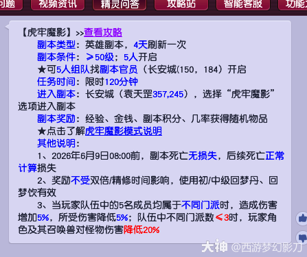

## 二、副本流程与Boss打法

1.开局与前置

进入副本后，跟着剧情走，依次对话程咬金、传信驿卒、秦琼。点击“叫阵敌兵”进入前两场战斗，这两场怪物血量和伤害都不高，全力输出快速通过即可。

之后会遇到吕布，这是一场必死战斗，直接防御等结束就好。

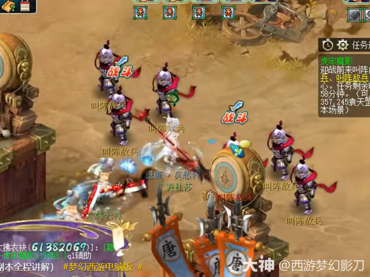

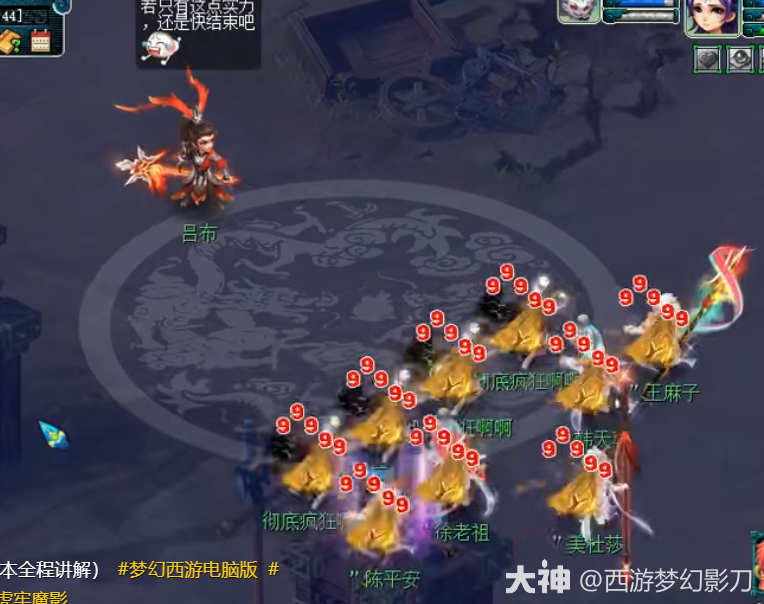

2.曹性

祭拜关公庙后找到传令副将，进入与曹性的战斗。

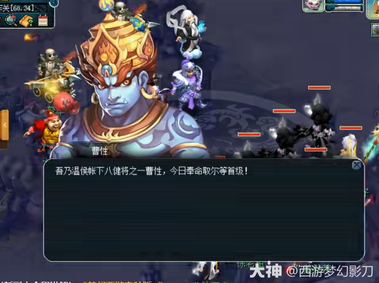

打法：优先集火主怪。前排的步卒（紫色天兵）会干扰输出节奏，主怪一死就好办多了。

细节：注意旁边的弩车和方士，如果队伍法防不高，建议及时接起罗汉金钟。

3.郝萌

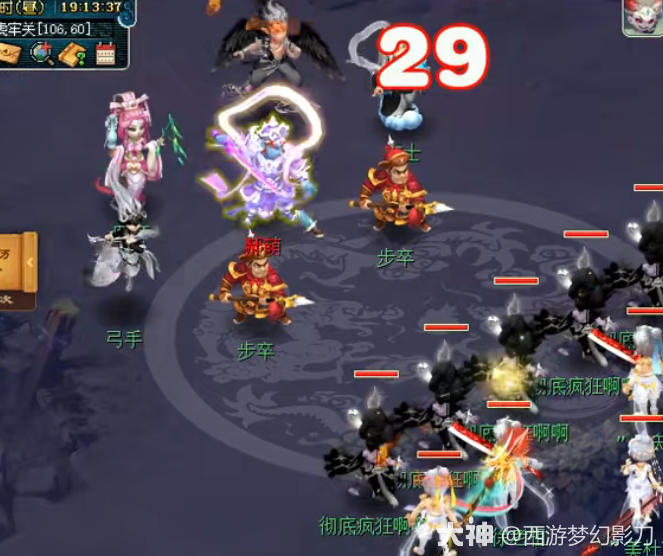

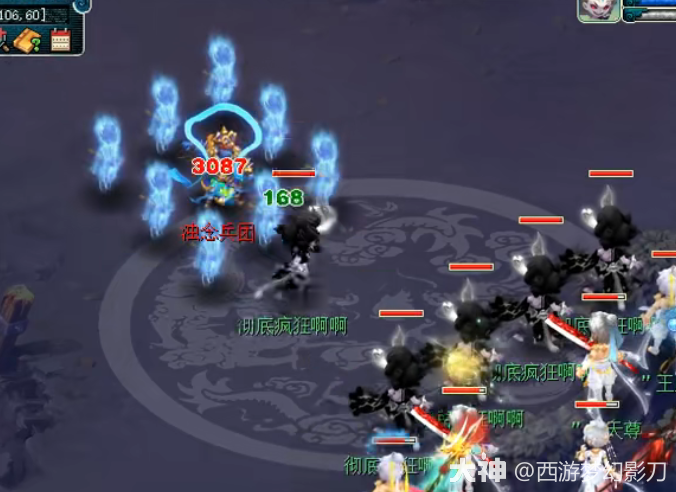

这场是连战，需要打两轮。

打法：建议优先击杀骑兵，因为骑兵专门点杀召唤兽，保护宝宝是第一要务。随后清理弓手和方士，降低面伤压力，步卒和医师可以留到最后。

特殊怪：击败小怪后会出现“浊念兵团”，速度快且不可封印，会使用百爪狂杀，注意恢复即可。

4.张辽（防御最低者挨打）

通过拓印小游戏后，迎来张辽。

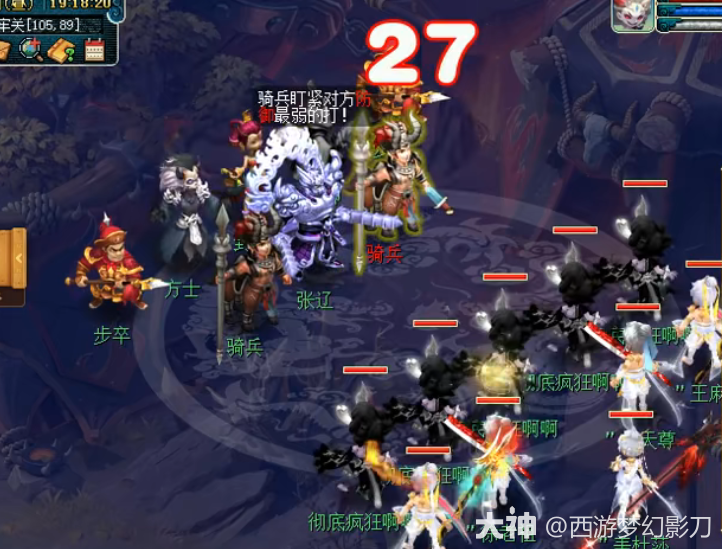

核心机制：张辽会带着骑兵在第一回合点杀队伍中“防御属性最低”的人物单位。

应对：如果你是队里防御最低的那个，第一回合记得防御、起纸人，或者让队友保护你。

击杀顺序：扛过第一波后，优先击杀张辽和骑兵，接着处理封卫和方士。注意封卫会使用笑里藏刀，要放罗汉的门派可以提前喝酒或起塔。

5.高顺（狮驼岭一速鹰击）

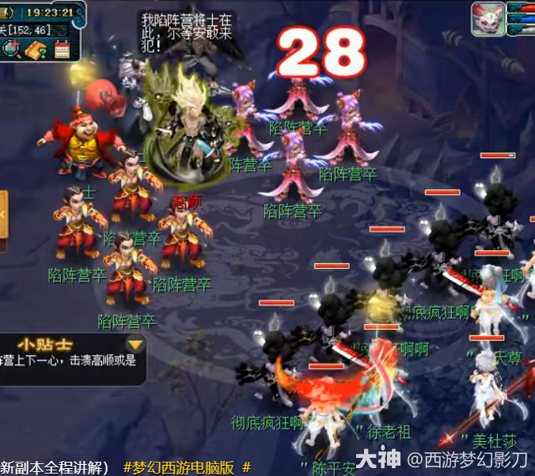

核心机制：主怪高顺是固定一速的狮驼岭，开场直接变身并当回合鹰击，无法封印。

打法：开场直接集火主怪！只要击飞主怪，他的“陷阵营”小兵会直接逃跑。

顺序：主怪飞了之后，按照骑兵→方士的顺序清理即可。

6.陈宫（法伤高，有阵眼）

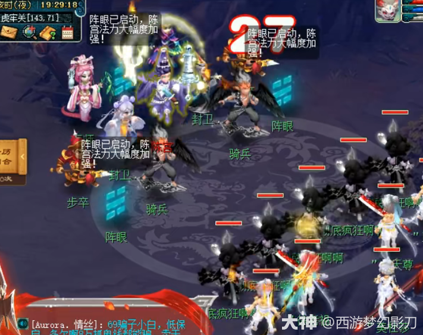

核心机制：主怪是魔王寨，法伤极高，且无法封印。场上存在“阵眼”。

打法：优先击杀阵眼，这样可以降低主怪的伤害。之后再去击杀骑兵（防止清宠）和封系。

建议：全程注意接罗汉，如果是法系多的队伍，带耐攻宝宝体验会更好。

## 三、最终决战：三战吕布：三战吕布

击败陈宫后，与秦琼对话选择模式。普通模式能在决战获得3个NPC助战（秦琼加伤害、尉迟敬德加奇袭、薛礼回血），竞速模式则无援助但冲击英雄榜。决战共分三个阶段：

第一阶段

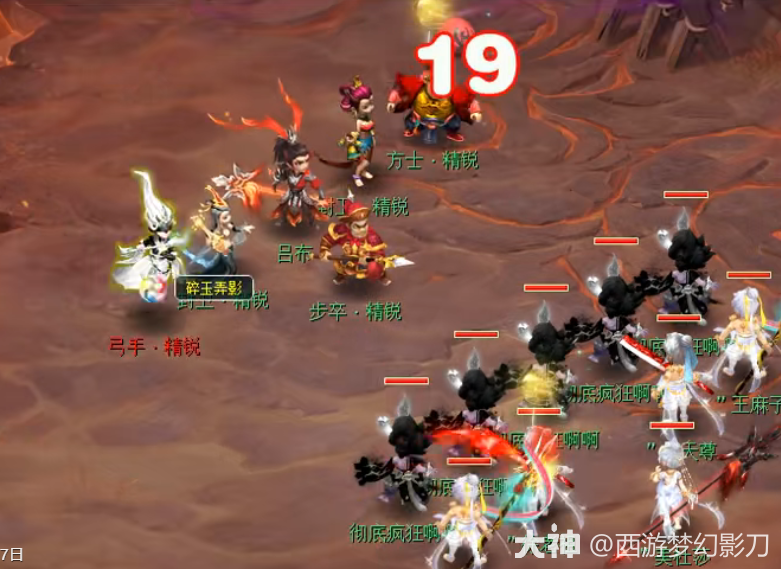

机制：主怪吕布是花果山，固定一速，每回合会使用三次“泼天乱棒”，造成大量溅射伤害。

打法：不用管小怪，全力集火吕布。只要把他打飞，就可以利用剩下的封卫来恢复状态、叠加增益buff，再进入下一阶段。

第二阶段

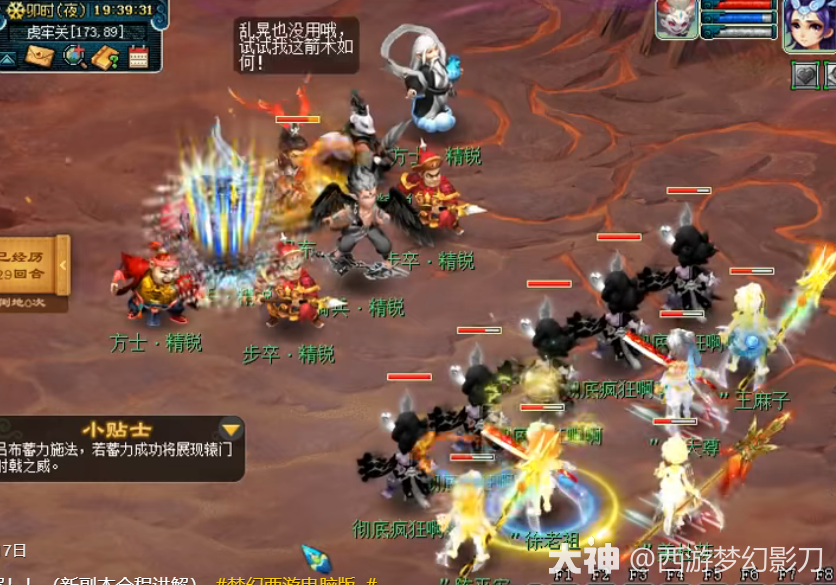

机制：吕布会蓄力施法，如果蓄力成功会释放高伤“辕门射戟”。同时，场上的方士和部卒会点杀队里血量最低的单位。

打法：依然优先点着吕布打，打断他的蓄力。如果打断成功，他会改用破血狂攻。注意罗汉不要断，保证全队血量健康。

第三阶段

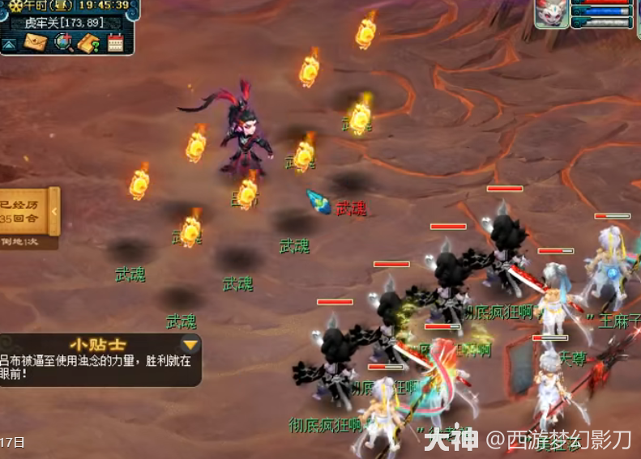

机制：吕布血条见底后会触发护盾无法选中，随后进入“浊念化”状态。每回合开始，他会召唤8个武魂，并释放“神针撼海”。

打法：这是最后的冲刺阶段。虽然满屏都是怪，但武魂抗性很低。直接点着主怪位置挂机群秒即可，只要击飞主怪，战斗就宣告胜利。

## 四、总结与建议

这个副本对队伍的硬件的确有一定要求，但机制远大于硬抗。只要记住几个关键点：张辽点杀防御最低、高顺开场集火、陈宫先杀阵眼、吕布全程优先击杀，普通玩家也能比较顺畅地通关。

结束后别忘了找李世民开启“皇宫秘宝”，必得物品奖励。祝大家好运，都能拿到心仪的奖励！